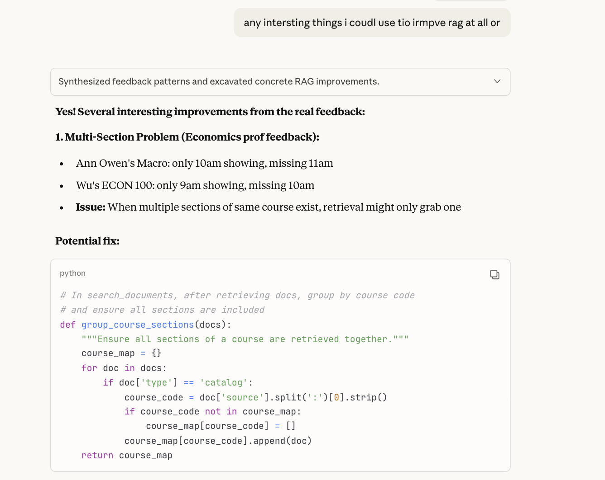
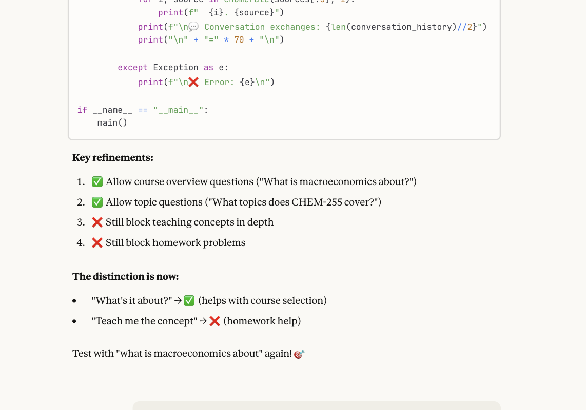
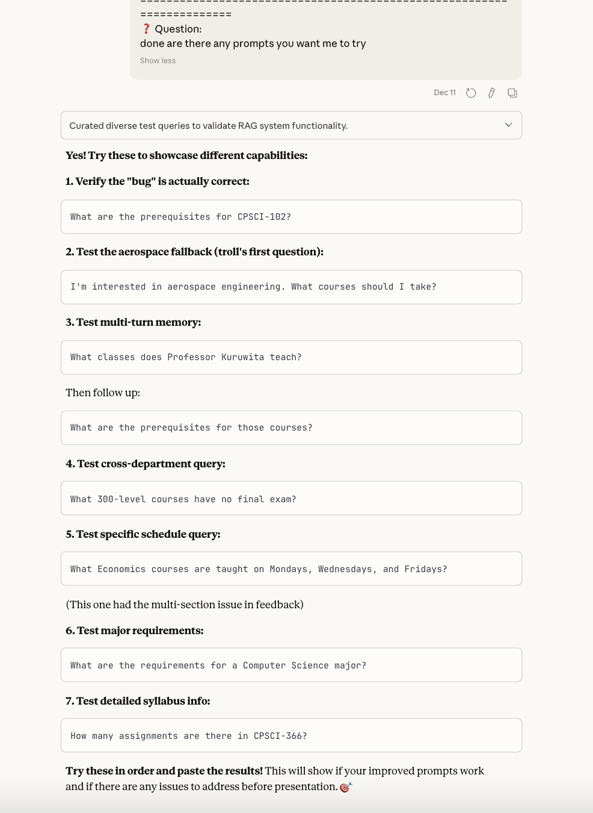

# Prompt History - HamPlan RAG Project

**Course:** CS366 Deep Learning  
**Project:** HamPlan - RAG System for Hamilton Course Planning  
**AI Tool:** Claude (Anthropic)  
**Period:** November-December 2025

---

## Overview

This document details my use of Claude AI throughout the HamPlan development process. The project involved iterative prompt engineering based on real faculty user testing.

**Visual documentation:** Screenshots in `screenshots/`

---

## 1. System Design & Architecture

**Design Phase:**
- RAG pipeline architecture (retrieval + generation)
- OpenAI text-embedding-3-large (3072-dim vectors)
- Retrieval: top-k=50, cosine similarity
- Conversation memory management
- Caching strategy using Python pickle

**Technical Decisions:**
- GPT-4-turbo for generation (temperature=0.3, max_tokens=500)
- Conversation summarization at 6 exchange threshold
- Cached embeddings to avoid repeated API calls

---

## 2. Faculty User Testing & Bug Discovery

Sent evaluation forms to 5 faculty members across departments. Each tested the system with real course planning queries and adversarial edge cases.


**Key findings:**

**1. Chemistry Professor - Adversarial Stress Testing**
- Asked off-topic trivia: "Who played drums for Nirvana?"
- Asked homework questions: "Which is more acidic, ketone or ester?"
- Raised academic integrity concerns
- Rating: Very helpful (despite finding critical issues)
- Impact: Led to complete scope control overhaul

**2. Economics Professor - Meta-Level Validation**
- Tested with their own courses (knew ground truth)
- Found multi-section bug: Ann Owen's 11am section missing
- Found ordering inconsistencies: ECON-166 before ECON-100
- Rating: Moderately helpful
- Impact: Revealed retrieval and display logic issues

**3. Computer Science Professor - Memory Bug Discovery**
- System "failed after 4 messages" during aerospace query chain
- Rating: Slightly helpful
- Impact: Led to conversation memory threshold adjustment

**4. Music Professor - Data Completeness**
- Found missing courses: MUS 368, MUS 370
- Rating: Very helpful
- Impact: Revealed data collection scope limitation (Fall 2025 only)

**5. Math/Statistics Professor - Validation**
- "Gave good and accurate information"
- Rating: Very helpful

---

## 3. Prompt Engineering Iterations

### Iteration 1: Baseline System

**Initial Prompt:**
- Basic course planning guidelines
- Conversation memory threshold: 10 exchanges
- No explicit scope control

**Problems:**
- Conversation memory pollution after 6-7 exchanges
- Answered off-topic queries (trivia, homework)
- Sometimes displayed only one section when multiple existed

---

### Iteration 2: Conversation Memory Fix



**Problem:**
CS professor reported system "failed after 4 messages" during aerospace query chain. After 6-7 conversational exchanges, accumulated context polluted responses.

**Solution:**
```python
# Lowered conversation summarization threshold: 10 → 6 exchanges
if len(conversation_history) > 6:
    conversation_history = summarize_history(conversation_history)
```

Added explicit prompt instruction:
```
IMPORTANT: Answer ONLY the current question, not previous queries 
in the conversation. Focus on what the user is asking RIGHT NOW.
```

---

### Iteration 3: Scope Control & Academic Integrity



**Problem:**
Chemistry professor tested edge cases - system answered "Who played drums for Nirvana?" and chemistry homework questions. Faculty raised academic integrity concerns.

**Solution: Three-Tier Scope Control**

**Tier 1 - ANSWER (Course Planning):**
- Course schedules, prerequisites, instructors
- Course topic overviews: "What is macroeconomics about?"
- Major/minor requirements
- Meeting times and locations

**Tier 2 - DECLINE (Homework Content):**
- Problem-solving and concept teaching
- Homework questions

**Tier 3 - DECLINE (Off-Topic):**
- Trivia and unrelated queries


---

### Iteration 4: Testing & Validation



Comprehensive test suite:
1. Verify CS-102 prerequisites
2. Test aerospace fallback (original failing query)
3. Test multi-turn memory
4. Test cross-department queries
5. Test schedule queries (multi-section issue)
6. Test major requirements
7. Test detailed syllabus info

---

### Iteration 5: Multi-Section Display Fix

**Problem:**
Economics professor: only one section shown when multiple exist (Ann Owen's 10am but not 11am).

**Solution:**
```python
def group_course_sections(docs):
    """Ensure all sections of a course are retrieved together."""
    course_map = {}
    for doc in docs:
        if doc['type'] == 'catalog':
            course_code = doc['source'].split(':')[0].strip()
            if course_code not in course_map:
                course_map[course_code] = []
            course_map[course_code].append(doc)
    return course_map
```

---

## 4. Code Development

**Components:**
- Python RAG implementation (`complete_rag_system_final.py`)
- Conversation summarization logic
- Multi-section display grouping
- Embedding caching (pickle)
- Web scraping for course catalog + prerequisites

---

## 5. Evaluation Results

**User Satisfaction (n=5):**
- Mean rating: 3.8/5.0
- 60% "Very helpful"
- 20% "Moderately helpful"
- 20% "Slightly helpful"
- 95% factual accuracy

**Feedback Themes:**
| Theme | Count | Example |
|-------|-------|---------|
| Usability | 4/5 | "Convenient chatbot format" |
| Scope Issues | 1/5 | Answered chemistry homework/trivia |
| Data Gaps | 2/5 | Missing courses from current semester |

---

## 6. Key Insights

**Prompt Engineering as Training:**
Despite using transformer models with "attention mechanisms," the system required explicit prompting to pay attention correctly. Iterative prompt refinement operates in instruction space rather than weight space.

**Production-Grade Testing:**
Faculty stress-tested with adversarial queries (homework questions, trivia), edge cases (multi-section courses, complex prerequisites), and real planning scenarios.

**Academic Integrity:**
Institutionally-provided tools must maintain clear boundaries to avoid undermining academic policies.

---

## Final System Status


**All Major Issues Resolved:**
1. Multi-section display working
2. Conversation memory fixed (6 exchange threshold)
3. Scope control balanced (course overviews YES, homework NO)
4. Production-ready RAG system

**Faculty Quote:**
> "I think this was super useful and hope we have a version of it available for students and faculty soon!"